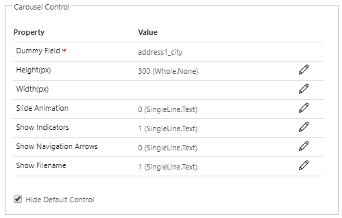

# PCF Carousel Control

## Overview

PCF Carousel Control made with Bootstrap 4 that shows images from entity notes/attachments. Control is bound to Single Line of Text field.

## Download

## Configuration

There are a few things that can be configured on the configuration page. All parameters are optional and there are default values set which can be found in the table below. 

| Field                  | Description                                                                    |
|------------------------|--------------------------------------------------------------------------------|
| Height(px)             | Set height of images in pixels. Default is value is null.                      |
| Width(px)              | Set width of images in pixels. Default is value is null.                       |
| Slide Animation        | Turn on(1) or off(0) slide animation. Slide animation is activated by default. |
| Show Indicators        | Show(1) or hide(0) slide indicators. Slide indicators are shown by default.    |
| Show Navigation Arrows | Show(1) or hide(0) navigation arrows. Navigation arrows are shown by default.  |
| Show Filename          | Show(1) or hide(0) filename. Filename is shown by default.                     |

## Preview

## Features

- Carousel with images from notes/attachments
- Adjustable height and width 
- Turn on/off slide animation between images
- Download image on click on the filename